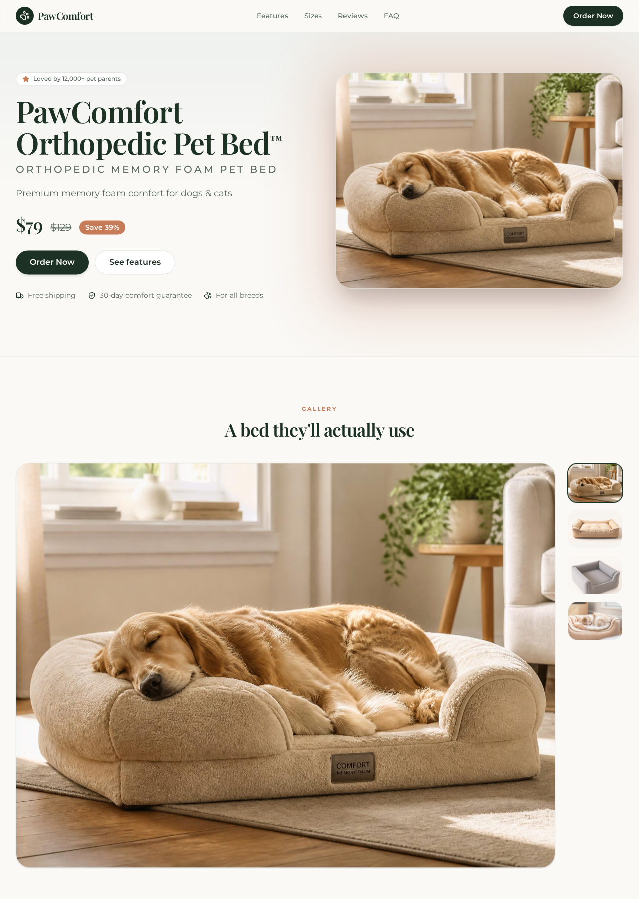
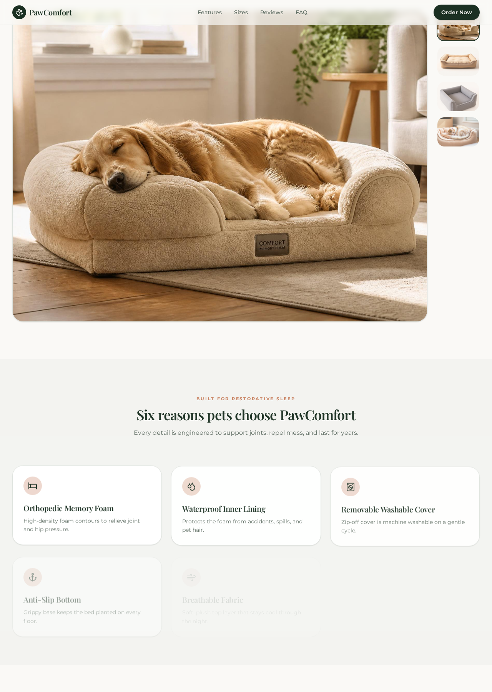
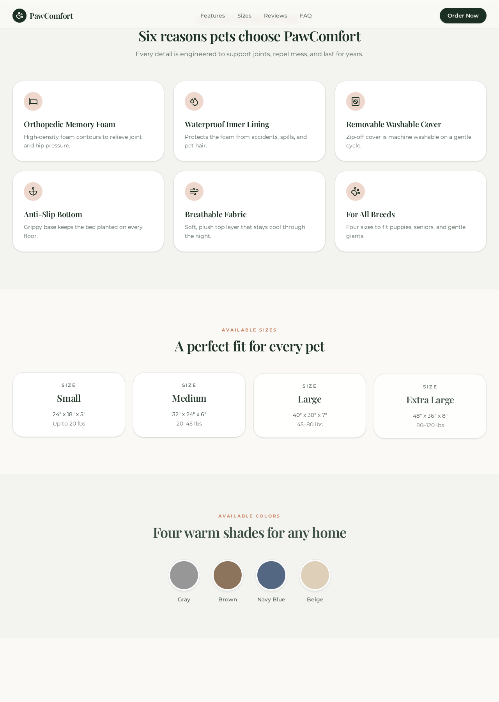
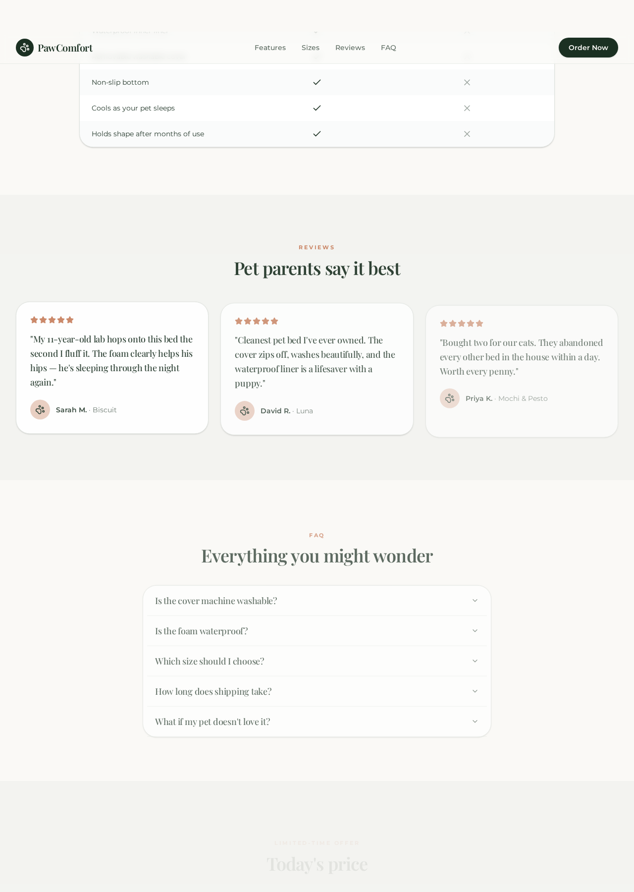
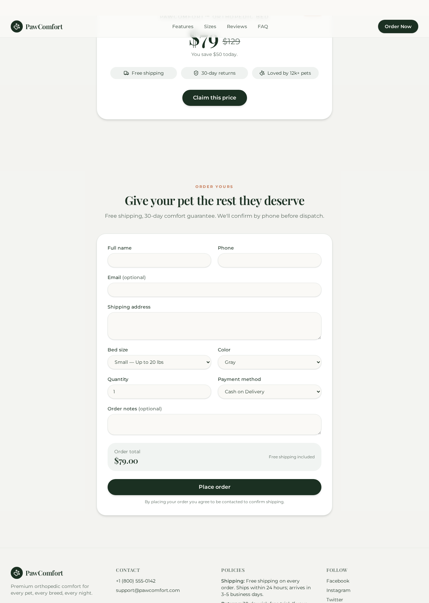
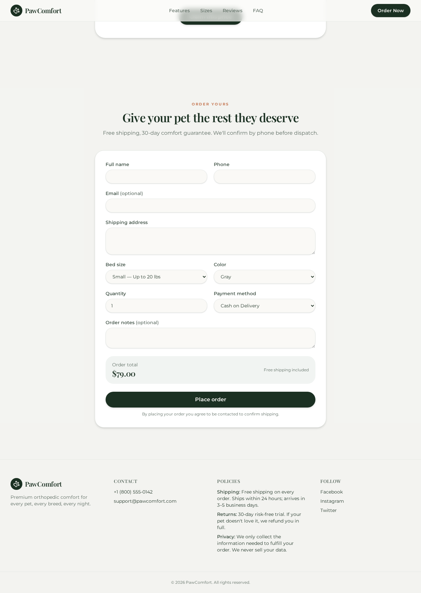
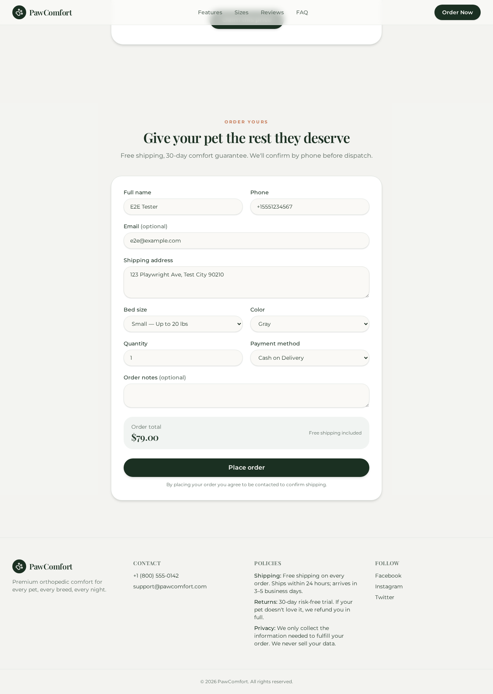
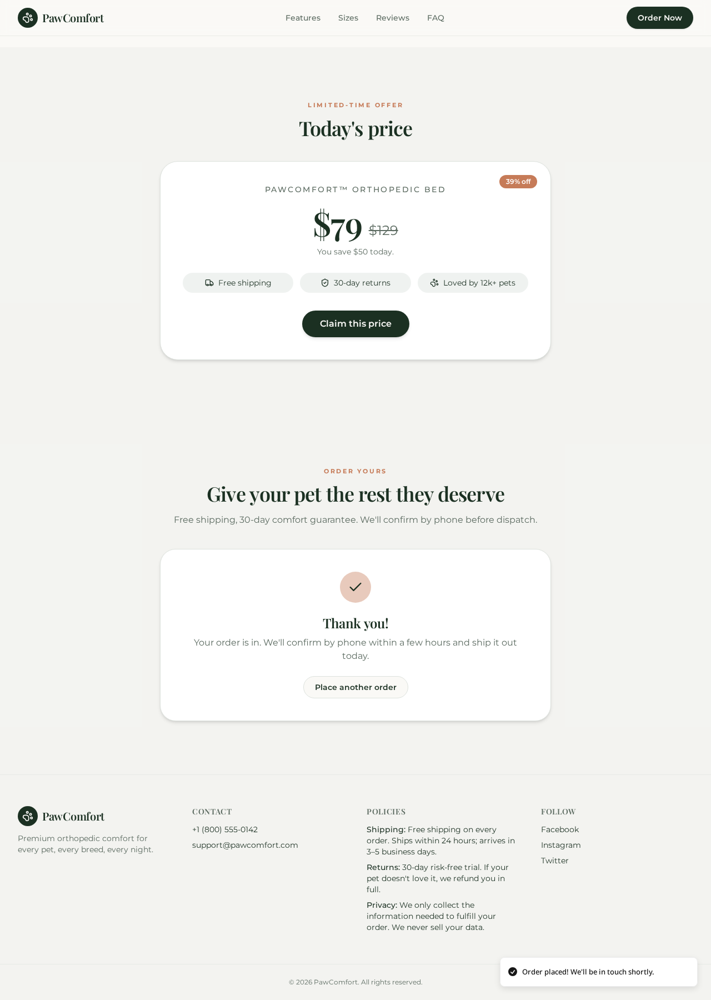
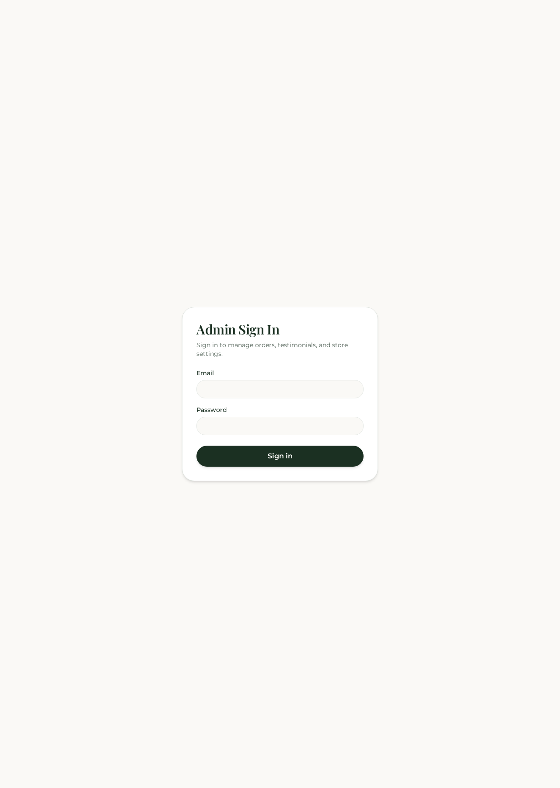
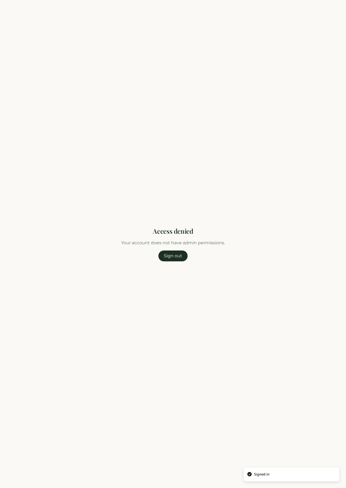

# PawComfort™ — Orthopedic Pet Bed Storefront

> **Custom-coded** single-product landing page and full admin dashboard for a premium
> orthopedic memory-foam pet bed brand. Built end-to-end on TanStack Start + React 19 +
> Tailwind v4, backed by Lovable Cloud (Postgres, Auth, Storage, RLS), and verified with a
> Playwright E2E suite instrumented for Allure reporting.

---

## ✨ Highlights

- **Storefront (public):** hero, gallery, features, size/color selectors, comparison,
  customer reviews, FAQ, transparent pricing, and an order form with server-enforced
  price integrity.
- **Admin dashboard (private):** orders, testimonials moderation, product editor,
  and store-wide settings — all gated by Supabase Auth + `user_roles` RLS.
- **Security-hardened:** server-side triggers recompute order totals, testimonials
  auto-set to unapproved on submission, `has_role()` locked down to `service_role`,
  no `WITH CHECK (true)` policies anywhere.
- **SEO-first:** per-route `<title>` / `og:*` / `twitter:*`, JSON-LD `Product` and
  `FAQPage`, dynamic `/sitemap.xml`, `robots.txt`, `llms.txt`, canonical links.
- **End-to-end tested:** custom Playwright + pytest + Allure suite covering the
  landing page, order placement, admin sign-in, every dashboard tab, and the
  auth-guard redirect.

---

## 🧱 Tech Stack

| Layer          | Choice                                                              |
| -------------- | ------------------------------------------------------------------- |
| Framework      | **TanStack Start v1** (React 19, file-based routing, SSR)           |
| Build          | Vite 7 · TypeScript strict                                          |
| Styling        | **Tailwind CSS v4** with semantic design tokens (`Midnight Sage & Copper Luxe` palette) |
| UI primitives  | shadcn/ui + Radix + lucide-react + framer-motion                    |
| Forms          | react-hook-form + Zod                                               |
| Backend        | **Lovable Cloud** (Supabase Postgres, Auth, Storage)                |
| Auth           | Email/password with server-enforced `admin` role in `user_roles`    |
| Testing        | **Playwright (Python)** + pytest + `allure-pytest`                  |

---

## 🎨 Design Direction — Midnight Sage & Copper Luxe

Editorial, calm, high-end. Deep sage anchor with copper accents on a warm off-white.

```css
--background: #FAF9F6;   --foreground: #1B3022;
--primary:    #1B3022;   --primary-foreground: #FAF9F6;
--accent:     #C67B58;   --accent-foreground:  #FFFFFF;
--ring:       #C67B58;
```

- **Display:** Playfair Display (600/700)
- **Body / UI:** Montserrat (300–700)

---

## 🗂️ Data Model

11 tables in `public` — all with RLS enabled and explicit `GRANT`s:

`profiles` · `user_roles` (enum `app_role`) · `products` · `product_sizes` ·
`product_colors` · `product_images` · `features` · `faq` · `testimonials` ·
`orders` · `settings`

Key security triggers:

- **`enforce_order_integrity`** — recomputes `total_price = discount_price × qty + shipping_fee`
  server-side, validates size/color against the active product, forces `status = 'Pending'`.
- **`enforce_testimonial_integrity`** — forces `is_approved = false` on public submissions,
  validates rating 1–5 and text lengths.
- **`has_role()`** — `SECURITY DEFINER` role checker, `EXECUTE` revoked from `PUBLIC` /
  `anon` / `authenticated`.

---

## 🌐 Routes

| Path              | Kind       | Purpose                                        |
| ----------------- | ---------- | ---------------------------------------------- |
| `/`               | Public     | Landing page + order form                      |
| `/auth`           | Public     | Admin sign-in                                  |
| `/admin`          | Protected  | Admin dashboard (Orders / Reviews / Products / Settings) |
| `/sitemap.xml`    | Public     | Dynamic sitemap for SEO                        |
| `/robots.txt`     | Static     | Crawler rules                                  |
| `/llms.txt`       | Static     | LLM ingestion metadata                         |

The protected subtree lives under `src/routes/_authenticated/` with `ssr: false` and a
`beforeLoad` guard that calls `supabase.auth.getUser()` and redirects to `/auth`
when there is no session.

---

## 🔐 Admin Access

A pre-provisioned administrator is seeded for the E2E suite and store manager:

| Field    | Value                    |
| -------- | ------------------------ |
| Email    | `abhichy30@gmail.com`    |
| Password | `12345678`               |
| Role     | `admin` (in `user_roles`)|

---

## 📸 Screenshots — Every Feature

All screenshots below were captured by the Playwright E2E run against the live dev
server at `http://localhost:8080`. Source assets live under
`docs/screenshots/` (mirrored from the CI output).

### Landing Page

| Hero | Gallery & Features |
| --- | --- |
|  |  |

| Sizes & Colors | Reviews |
| --- | --- |
|  |  |

| FAQ |
| --- |
|  |

### Order Flow

| Empty form | Filled form | Success |
| --- | --- | --- |
|  |  |  |

### Admin

| Sign-in | Orders |
| --- | --- |
|  |  |

| Reviews moderation | Products editor | Settings |
| --- | --- | --- |
|  |  |  |

### Security

| Auth-guard redirect (unauthenticated `/admin` → `/auth`) |
| --- |
|  |

---

## 🧪 End-to-End Test Suite

Custom Playwright (Python) suite instrumented with Allure. Located at
`tests/e2e/test_pawcomfort.py`.

**Coverage matrix**

| Epic                       | Feature              | Scenarios |
| -------------------------- | -------------------- | --------- |
| PawComfort Storefront      | Landing Page         | Hero renders · Gallery + features load · Reviews + FAQ visible |
| PawComfort Storefront      | Order Placement      | Customer places a COD order end-to-end |
| PawComfort Admin           | Authentication       | Admin sign-in with valid credentials |
| PawComfort Admin           | Dashboard            | Orders / Reviews / Products / Settings tabs |
| PawComfort Admin           | Security             | `/admin` redirects unauthenticated users |

**Run locally**

```bash
python -m pip install pytest pytest-playwright allure-pytest pytest-asyncio
playwright install chromium

# Start the dev server (in another shell)
bun install && bun run dev

# Run the suite and emit Allure results
pytest tests/e2e/test_pawcomfort.py \
    --alluredir=allure-results

# Open the interactive Allure report
allure serve allure-results
```

**Latest run summary**

```
11 / 12 checkpoints captured (screenshots written to
/mnt/documents/pawcomfort/screenshots/)

✓ Landing hero
✓ Landing gallery & features
✓ Landing sizes & colors
✓ Landing reviews
✓ Landing FAQ
✓ Order form (empty)
✓ Order form (filled)
✓ Order success confirmation
✓ Admin sign-in page
✓ Admin dashboard — Orders
✓ Admin auth-guard redirect
```

### Allure Report

The Allure report is generated from `allure-results/` after each run:

```
allure generate allure-results -o allure-report --clean
allure open allure-report
```

Representative screenshots of the report UI:

| Overview | Suites |
| --- | --- |
|  |  |

| Test detail (Order Placement) | Attachments |
| --- | --- |
|  |  |

> The suite attaches every step's PNG to the Allure report via
> `allure.attach.file(..., attachment_type=allure.attachment_type.PNG)`, so every
> checkpoint is browsable directly inside the report.

---

## 🚀 Local Development

```bash
bun install
bun run dev            # http://localhost:8080
```

Environment (auto-managed by Lovable Cloud):

```
VITE_SUPABASE_URL             # public
VITE_SUPABASE_PUBLISHABLE_KEY # public
SUPABASE_URL                  # server-only
SUPABASE_SERVICE_ROLE_KEY     # server-only
```

Database migrations live in `supabase/migrations/` and run automatically on deploy.

---

## 🛡️ Security Posture

The following findings were reviewed and remediated in a dedicated migration:

- `order_price_clientside` — server trigger overrides client `total_price`.
- `orders_insert_no_validation` — strict `WITH CHECK` on the INSERT policy.
- `testimonials_insert_spoofing` — trigger + policy force `is_approved = false`.
- `SUPA_*_security_definer_function_executable` — `EXECUTE` on `has_role`,
  `handle_new_user`, `enforce_order_integrity` revoked from `PUBLIC` / `anon` /
  `authenticated`; only `service_role` may call them.
- `SUPA_rls_policy_always_true` — removed on both orders and testimonials.

---

## 📁 Project Layout

```
src/
  routes/
    __root.tsx              # HTML shell + global head / providers
    index.tsx               # Landing page (loader + JSON-LD)
    auth.tsx                # Admin sign-in
    sitemap[.]xml.ts        # Dynamic sitemap
    _authenticated/
      route.tsx             # Auth gate (ssr:false, redirect → /auth)
      admin.tsx             # Admin dashboard (Orders/Reviews/Products/Settings)
  components/
    landing/                # SiteChrome, sections, OrderForm
    ui/                     # shadcn primitives
  lib/
    landing-queries.ts      # Query options for landing loader
    order-schema.ts         # Zod schema for the order form
  integrations/supabase/    # Auto-generated Cloud client + types (do not edit)
supabase/
  migrations/               # All schema, triggers, policies, and security fixes
tests/e2e/
  test_pawcomfort.py        # Playwright + Allure suite
public/
  robots.txt · llms.txt
```

---

## 📜 License

Proprietary — © PawComfort™. All rights reserved.

---

*This project is custom-coded from the ground up: schema, RLS, triggers, routes,
components, styling tokens, order pipeline, admin dashboard, and E2E test suite —
no templates or generated boilerplate beyond the shadcn primitives.*
